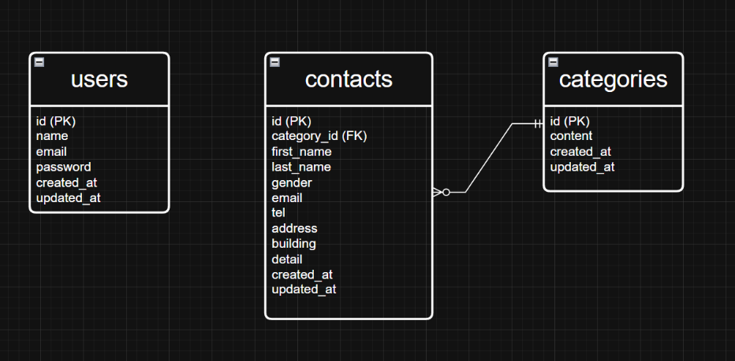

# Contact-app

## 環境構築
- git clone https://github.com/omu-39/contact-app.git
- cd contact-app
```bash
docker run --rm \
    -u "$(id -u):$(id -g)" \
    -v "$(pwd):/var/www/html" \
    -w /var/www/html \
    -e COMPOSER_CACHE_DIR=/tmp/composer_cache \
    laravelsail/php82-composer:latest \
    composer install
```
- cp .env.example .env
- ./vendor/bin/sail up -d
- ./vendor/bin/sail artisan key:generate
- ./vendor/bin/sail artisan migrate --seed
- ./vendor/bin/sail npm install
- ./vendor/bin/sail npm run build
- 開発時（Vite）: ./vendor/bin/sail npm run dev

## 使用技術(実行環境)

- PHP 8.2
- Laravel 10.x
- Laravel Sail（Docker）
- Tailwind CSS 3.4
- MySQL
- composer install

## ER図



## URL
- お問い合わせ入力画面：http://localhost
- お問い合わせ入力確認画面 :http://localhost/confirm
- お問い合わせサンクスページ :http://localhost/thanks
- お問い合わせ管理画面 :http://localhost/admin
- phpMyAdmin :http://localhost:8080/
